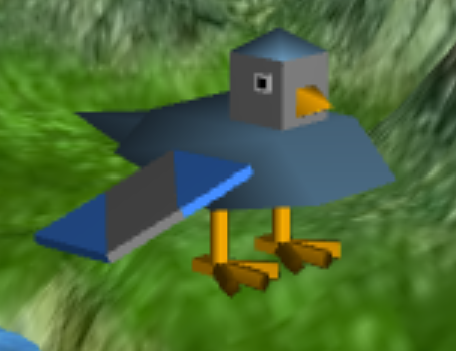

## Tree's textures:

- https://www.nicepng.com/ourpic/u2e6a9e6i1r5r5i1_2d-trees-3d-max-tree-model/
- https://www.clipartmax.com/middle/m2i8m2N4Z5H7d3d3_2d-trees-tree/

## Obj Files:

- https://www.turbosquid.com/3d-models/free-3ds-mode-rowboat-boat/675083
- https://www.turbosquid.com/3d-models/obelisk-set-3d-model-1903060

## Screenshots:

### Screenshot 1: Panorama

### Screenshot 2: Bird

### Screenshot 3: Terrain

### Screenshot 4: Nest and Eggs

### Screenshot 5: Trees

### Screenshot 6: Final

### Project developed by:

- André Sousa (up202005277)
- Pedro Fonseca (up202008307)

Class 02, Group 05