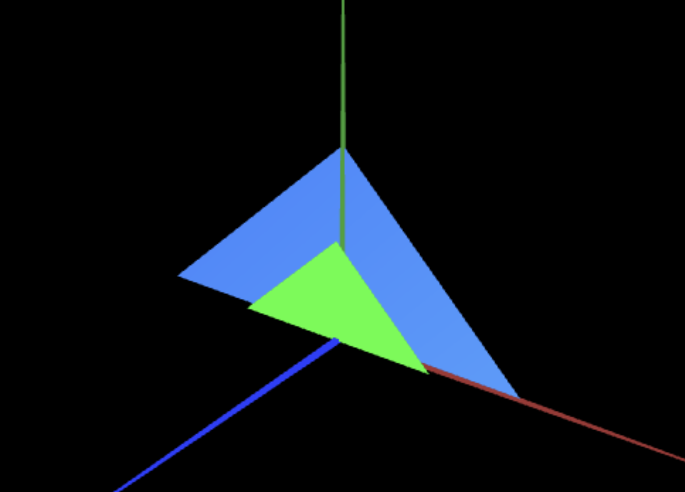

# CG 2022/2023

## Group T02G05

## TP 1 Notes

(add your main observations/remarks about your experiments here, in a bulleted list, and remove this line. Some examples below)

- In exercise 1 we learned how to draw triangles
- In exercise 1 we learned  how orientation works (right hand rule). 
- In exercise 1 we learned how checkboxes work and how to work with them.
- In exercise 2 we reinforced what we learned in exercise 1.
- In exercise 2 we played around with location and color as the screenshot taken shows.

