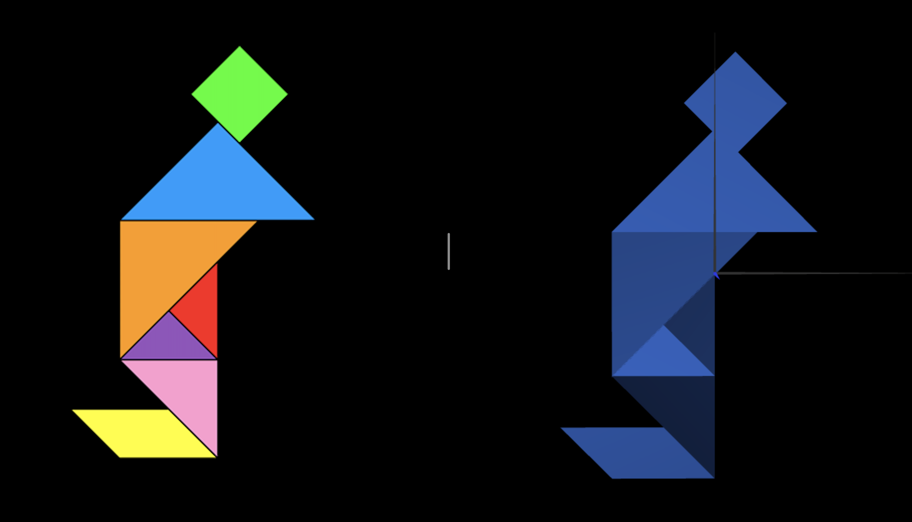
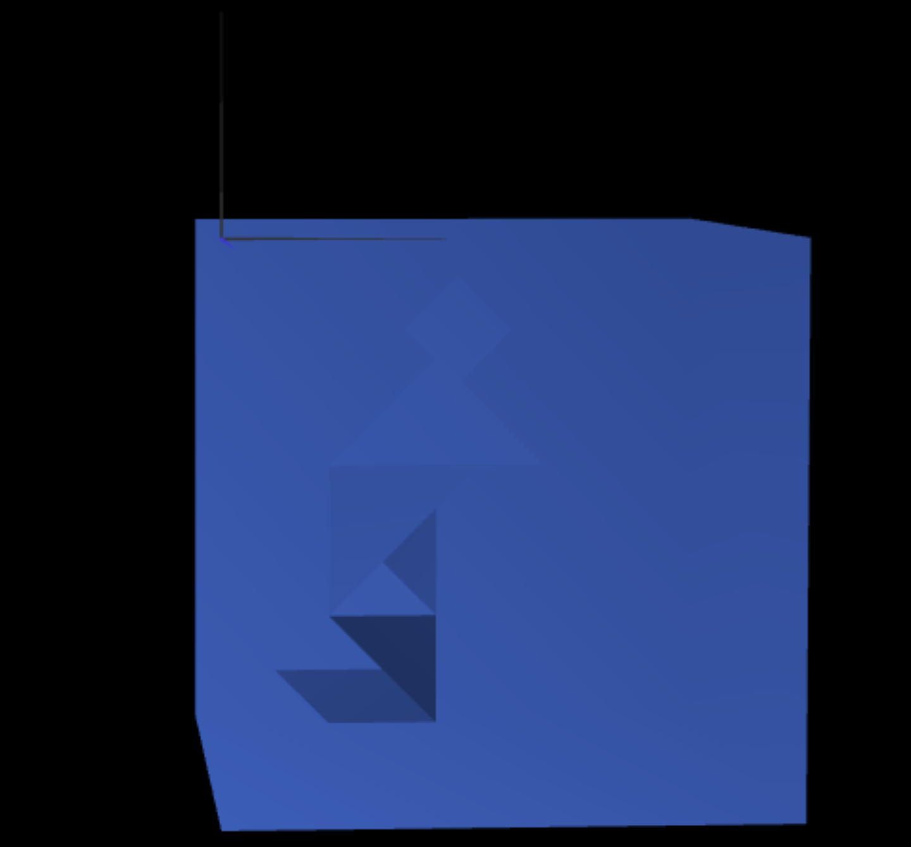

# CG 2022/2023

## Group T02G05

## TP 2 Notes

- In exercise 1 we had problems using the CGF functions for the transformations therefore we ended up using the webGL functions instead.
- In exercise 1 we had difficulties transfering the tangram from the MyScene class to a proper class.

- In exercise 2 we improved our understanding of the right hand rule

- In exercises 2 and 3 we improved our understanding of the WebCGF functions to make geometric transformations.

