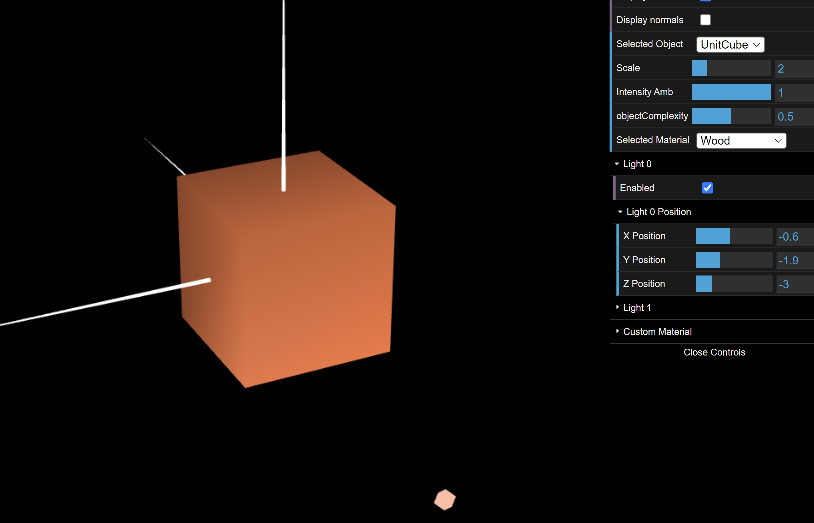
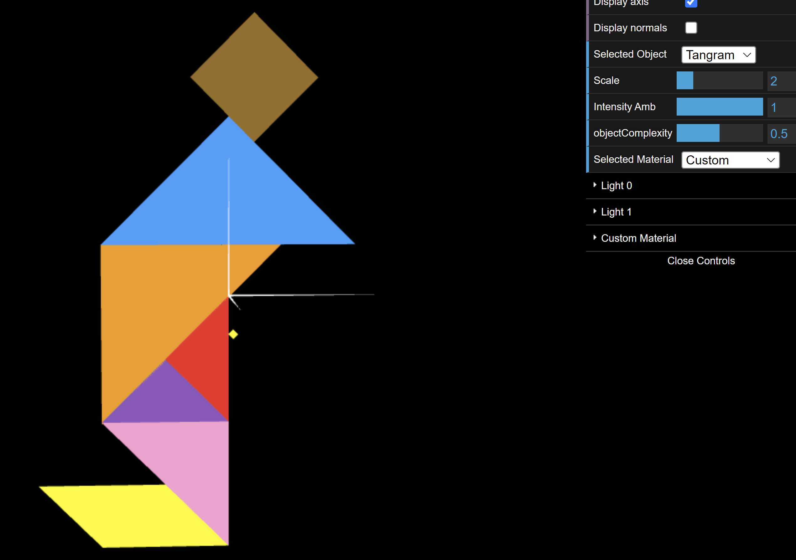
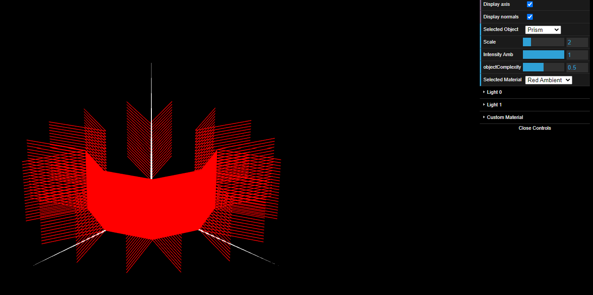

# CG 2022/2023

## Group T02G05

## TP 3 Notes

- Exercise 7: Since we are defining the normals in each vertex of the lateral face and the 4 normals are parallel, it is the same as using constant shading in that face.

