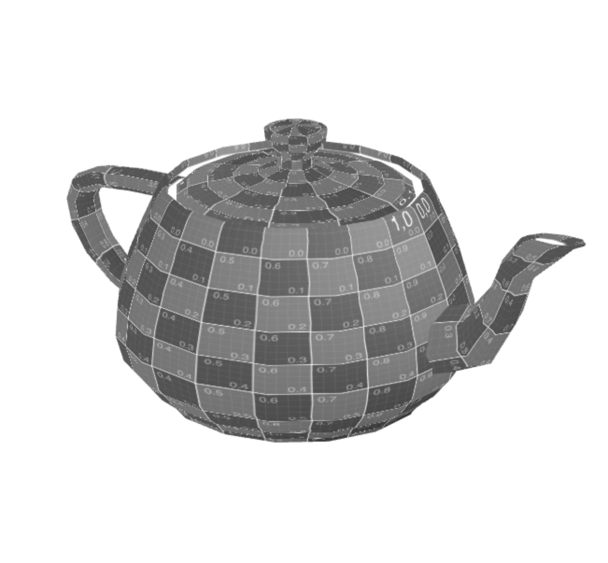
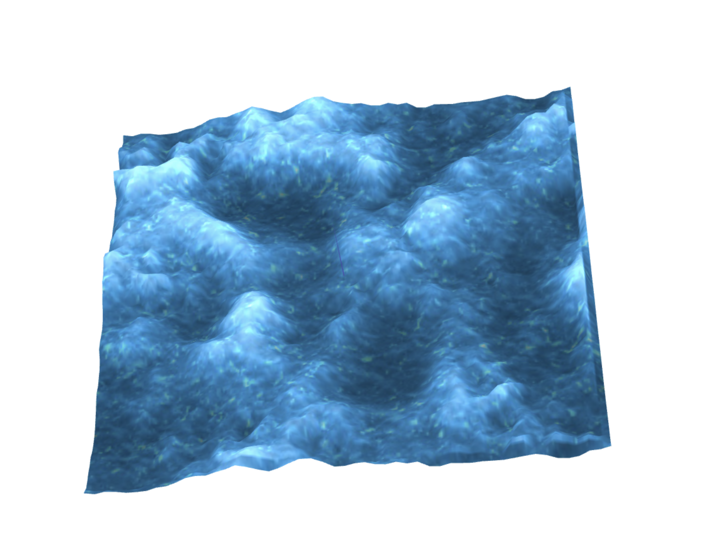

# CG 2022/2023

## Group T02G05

## TP 5 Notes

With these exercises we improved our knowledge regarding the use of shaders.

Overall we had several difficulties in the general usage of shaders, namely in:
- Understanding shader basics
- Shader language syntax
- Shader debugging
- Shader optimization

